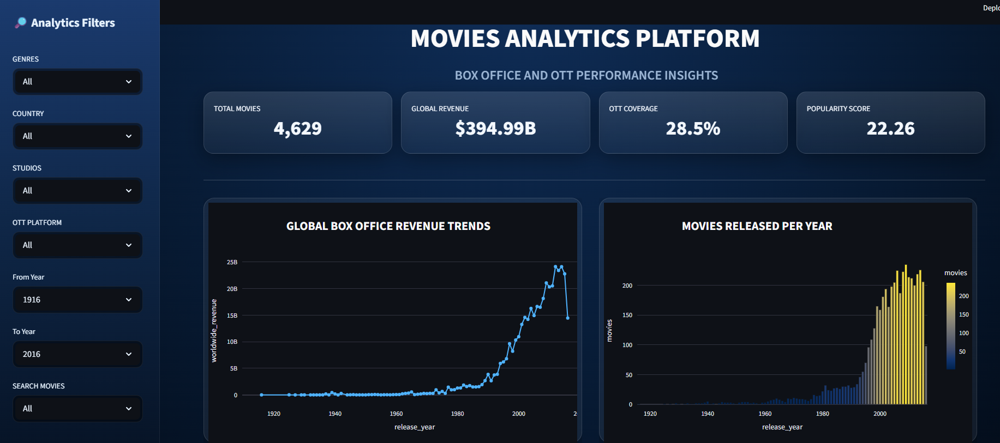
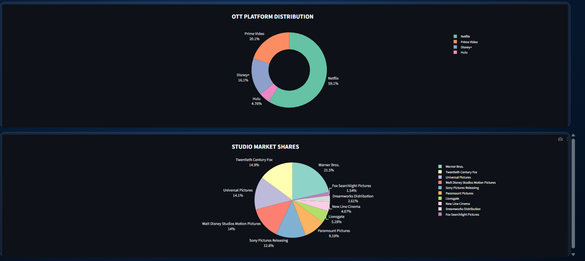
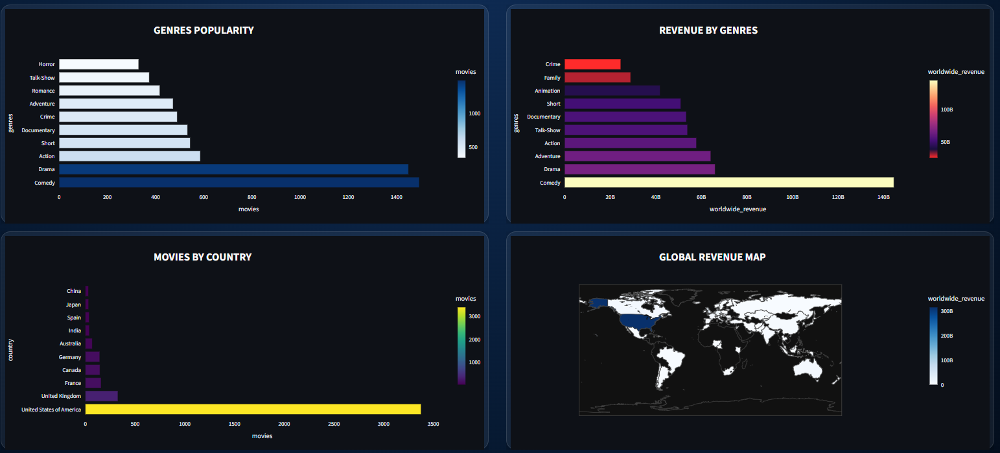
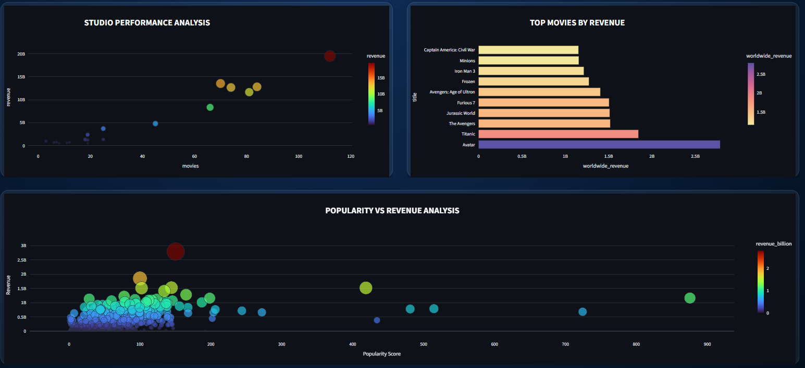
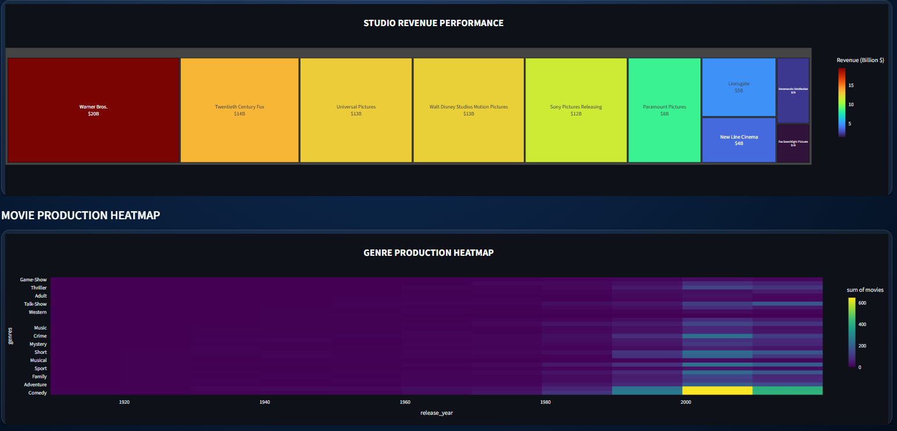
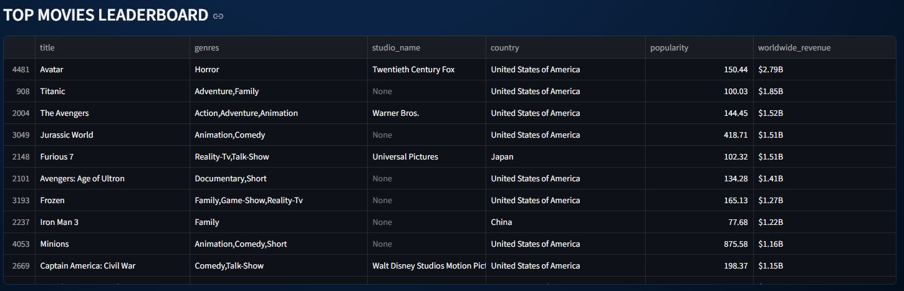

#  MOVIE ANALYTICS PLATFORM FOR BOX OFFICE AND OTT PERFORMANCE  

---

##  ABSTRACT  

The Movie Analytics Platform is an end-to-end data engineering and analytics solution designed to process and analyze large-scale movie datasets across Box Office and OTT platforms.  

This platform integrates multiple data sources and transforms raw, unstructured data into structured, analytics-ready datasets using a modern cloud-based architecture.  

By leveraging Snowflake, PySpark, Apache Airflow, and Streamlit, the system enables efficient data processing, automated workflows, and interactive business intelligence dashboards for data-driven decision-making.

---

##  OBJECTIVE  

- Design a **scalable data pipeline architecture**  
- Integrate and process **multi-source movie datasets**  
- Perform **data cleaning, transformation, and enrichment**  
- Build **efficient data models using star schema**  
- Enable **analytical querying and reporting**  
- Develop a **professional interactive dashboard**  
- Automate workflows using **Apache Airflow**  

---

##  SYSTEM ARCHITECTURE

Data Sources (TMDB, IMDB, OTT, Box Office) 
                ↓ 
     Data Ingestion (PySpark) 
                ↓ Snowflake RAW Layer (Bronze) ↓ Silver Layer (Data Cleaning & Transformation) ↓ Gold Layer (Business Transformation & Aggregation) ↓ Fact & Dimension Tables (Star Schema) ↓ Analytics View (VW_MOVIE_ANALYTICS) ↓ Airflow (Pipeline Orchestration) ↓ Streamlit Dashboard (Visualization Layer)

---

##  TECHNOLOGY STACK  

| Layer | Technology |
|------|-----------|
| Data Warehouse | Snowflake |
| Data Processing | PySpark, Snowpark |
| Orchestration | Apache Airflow |
| Visualization | Streamlit, Plotly |
| Programming | Python |
| Version Control | Git, GitHub |

---

##  DATA PIPELINE  

###  Data Collection  
- TMDB Movies Dataset  
- IMDB Titles & Ratings  
- OTT Platform Data  
- Box Office Revenue Data  

---

###  Data Ingestion  
- PySpark ingestion into Snowflake  
- Stored in RAW schema (Bronze Layer)  

---

###  Bronze Layer  
- Raw structured data  
- No transformations  

---

###  Silver Layer  
- Data cleaning  
- Deduplication  
- Null handling  
- Standardization  

---

###  Gold Layer  
- Business logic  
- KPI calculations  
- Aggregations  

---

##  DATA MODELING  

### Schema Type  
-  Star Schema  

### Fact Tables  
- FACT_MOVIE_PERFORMANCE  
- FACT_BOXOFFICE  
- FACT_OTT_AVAILABILITY  

### Dimension Tables  
- DIM_MOVIE  
- DIM_DATE  

---

##  ANALYTICS VIEW  

### VW_MOVIE_ANALYTICS  

- Centralized analytical dataset  
- Combines fact and dimension tables  
- Optimized for dashboard queries  

---

##  ORCHESTRATION (AIRFLOW)  

- DAG-based scheduling  
- Automated pipeline execution  

### Tasks  
- Data ingestion  
- Silver transformations  
- Gold transformations  
- Fact & dimension creation  

---

##  DASHBOARD (STREAMLIT)  

### Features  
- Interactive filters (Genre, Country, Studio, OTT, Year)  
- Dynamic KPI metrics  
- Real-time visualizations  

---

### Key Visualizations  

- Global Box Office Revenue Trend  
- OTT Platform Distribution (Donut Chart)  
- Studio Market Share (Pie Chart)  
- Genre Popularity Analysis  
- Revenue by Genre  
- Movies by Country  
- Studio Revenue Performance (Treemap)  
- Top Movies by Revenue  
- Movie Release Trends  
- Genre Heatmap  
- Top Movies Leaderboard  

---

##  DASHBOARD SNAPSHOTS  

###  Dashboard Overview

  

---

###  OTT Platform Distribution & Studio Market Share

  

---

###  Genre Popularity & Country Analysis

  

---

###  Performance & Revenue Insights

  

---

###  Studio Revenue Heatmap & Trends

  

---

###  Top Movies Leaderboard

  

---

##  BUSINESS USE CASES  

- Analyze **global box office performance**  
- Compare **OTT platform distribution**  
- Identify **top-performing genres and studios**  
- Enable **data-driven business decisions**  
- Support **content strategy and investments**
