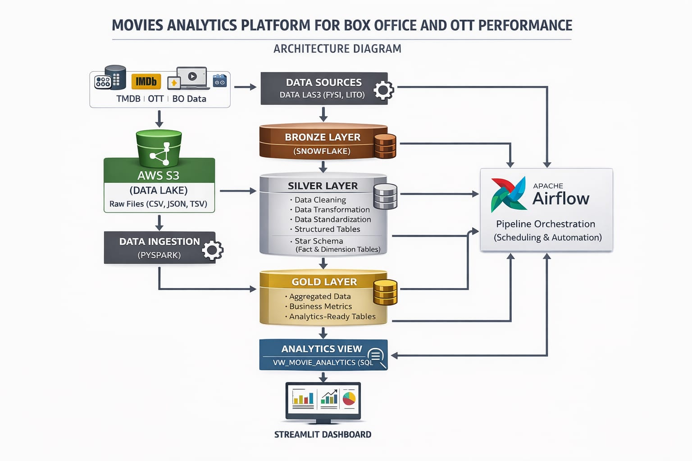

#  MOVIE ANALYTICS PLATFORM FOR BOX OFFICE AND OTT PERFORMANCE  

---

##  ABSTRACT  

The Movie Analytics Platform is an end-to-end data engineering and analytics solution designed to analyze Box Office and OTT performance using data from multiple sources such as TMDB, IMDB, OTT platforms, and Box Office datasets. The system utilizes technologies like Snowflake, PySpark, Apache Airflow, and Streamlit to ingest, process, and transform raw data into structured, analytics-ready formats. By implementing a layered architecture, the platform enables efficient data processing and supports the generation of insights related to revenue trends, genre performance, and OTT distribution. The final output is presented through an interactive dashboard, allowing users to explore and analyze key business metrics effectively

---

##  OBJECTIVE  

- Design a **scalable data pipeline architecture**  
- Integrate and process **multi-source movie datasets**  
- Perform **data cleaning, transformation, and enrichment**  
- Build **efficient data models using star schema**  
- Enable **analytical querying and reporting**  
- Develop a **professional interactive dashboard**  
- Automate workflows using **Apache Airflow**  

---

##  SYSTEM ARCHITECTURE

  

---

##  TECHNOLOGY STACK  

| Layer | Technology |
|------|-----------|
| Data Warehouse | Snowflake |
| Data Processing | PySpark, Snowpark |
| Orchestration | Apache Airflow |
| Visualization | Streamlit, Plotly |
| Programming | Python |
| Version Control | Git, GitHub |

---

##  DATA PIPELINE  

###  Data Collection  
- TMDB Movies Dataset  
- IMDB Titles & Ratings  
- OTT Platform Data  
- Box Office Revenue Data  

---

###  Data Ingestion  
- PySpark ingestion into Snowflake  
- Stored in RAW schema (Bronze Layer)  

---

###  Bronze Layer  
- Raw structured data  
- No transformations  

---

###  Silver Layer  
- Data cleaning  
- Deduplication  
- Null handling  
- Standardization  

---

###  Gold Layer  
- Business logic  
- KPI calculations  
- Aggregations  

---

##  DATA MODELING  

### Schema Type  
-  Star Schema  

### Fact Tables  
- FACT_MOVIE_PERFORMANCE  
- FACT_BOXOFFICE  
- FACT_OTT_AVAILABILITY  

### Dimension Tables  
- DIM_MOVIE  
- DIM_DATE  

---

##  ANALYTICS VIEW  

### VW_MOVIE_ANALYTICS  

- Centralized analytical dataset  
- Combines fact and dimension tables  
- Optimized for dashboard queries  

---

##  ORCHESTRATION (AIRFLOW)  

- DAG-based scheduling  
- Automated pipeline execution  

### Tasks  
- Data ingestion  
- Silver transformations  
- Gold transformations  
- Fact & dimension creation  

---

##  DASHBOARD (STREAMLIT)  

### Features  
- Interactive filters (Genre, Country, Studio, OTT, Year)  
- Dynamic KPI metrics  
- Real-time visualizations  

---

### Key Visualizations  

- Global Box Office Revenue Trend  
- OTT Platform Distribution (Donut Chart)  
- Studio Market Share (Pie Chart)  
- Genre Popularity Analysis  
- Revenue by Genre  
- Movies by Country  
- Studio Revenue Performance (Treemap)  
- Top Movies by Revenue  
- Movie Release Trends  
- Genre Heatmap  
- Top Movies Leaderboard  

---

##  DASHBOARD SNAPSHOTS  

###  Dashboard Overview

  

---

###  OTT Platform Distribution & Studio Market Share

  

---

###  Genre Popularity & Country Analysis

  

---

###  Performance & Revenue Insights

  

---

###  Studio Revenue Heatmap & Trends

  

---

###  Top Movies Leaderboard

  

---

##  BUSINESS USE CASES  

- Analyze **global box office performance**  
- Compare **OTT platform distribution**  
- Identify **top-performing genres and studios**  
- Enable **data-driven business decisions**  
- Support **content strategy and investments**

## CONCLUSION

The Movie Analytics Platform demonstrates a complete end-to-end data engineering pipeline that transforms raw movie datasets into structured, analytics-ready insights. By integrating multiple data sources and applying Bronze, Silver, and Gold layer architecture, the system ensures efficient data processing, scalability, and reliability. The use of star schema modeling enhances query performance, while the Streamlit dashboard enables interactive visualization of key metrics such as revenue trends, OTT distribution, and genre performance. Overall, this project highlights the significance of data-driven decision-making in improving business strategies and optimizing movie performance in the entertainment industry.
